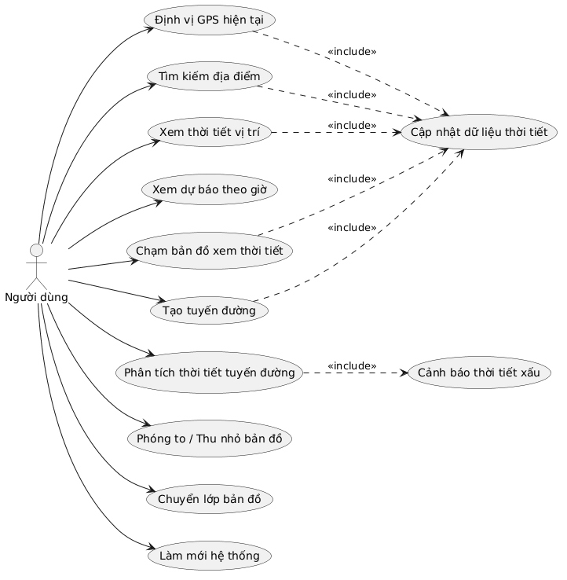
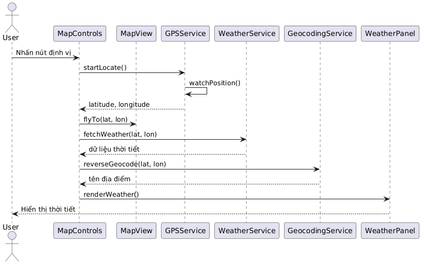
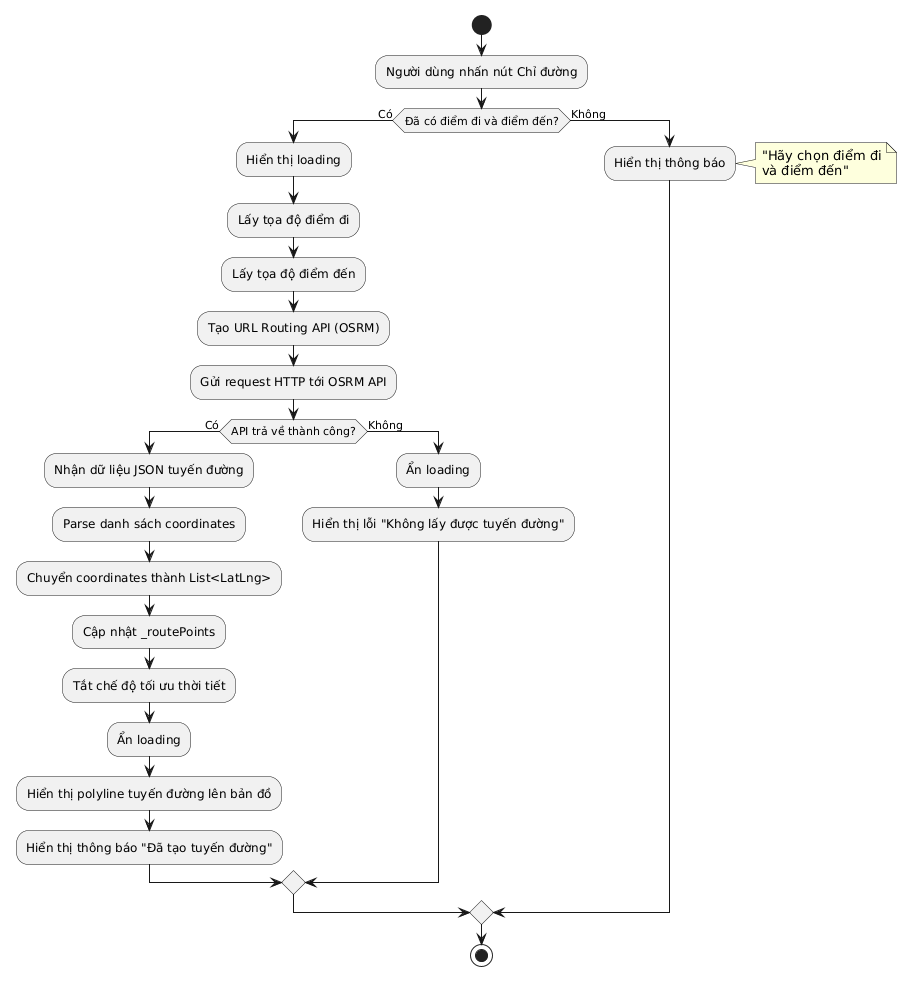
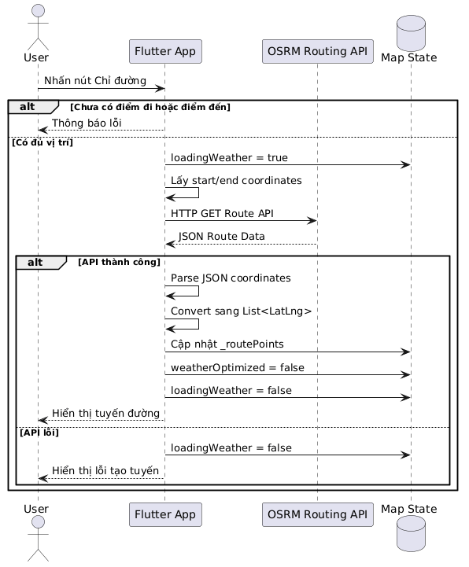
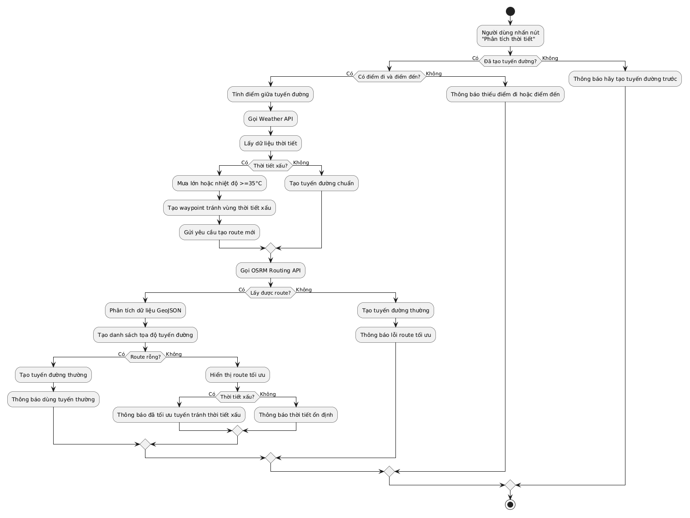
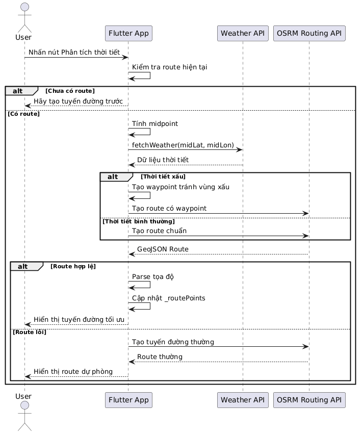

<!-- # weatherapp

A new Flutter project.

## Getting Started

This project is a starting point for a Flutter application.

A few resources to get you started if this is your first Flutter project:

- [Learn Flutter](https://docs.flutter.dev/get-started/learn-flutter)
- [Write your first Flutter app](https://docs.flutter.dev/get-started/codelab)
- [Flutter learning resources](https://docs.flutter.dev/reference/learning-resources)

For help getting started with Flutter development, view the
[online documentation](https://docs.flutter.dev/), which offers tutorials,
samples, guidance on mobile development, and a full API reference. -->
# 1. GIỚI THIỆU ĐỀ TÀI
## 1.1 Tên đề tài

Ứng dụng dự báo và cảnh báo thời tiết thông minh trên bản đồ số – WeatherMapInfo

## 1.2 Bối cảnh thực tế

Trong cuộc sống hiện nay, thời tiết ảnh hưởng rất lớn đến:

* Việc di chuyển
* Công việc hằng ngày
* Hoạt động ngoài trời
* Du lịch
* Nông nghiệp
* Giao thông vận tải

Tuy nhiên, nhiều ứng dụng thời tiết hiện tại chỉ hiển thị dữ liệu dạng văn bản hoặc theo thành phố lớn, chưa hỗ trợ:

* Hiển thị trực quan trên bản đồ
* Theo dõi theo vị trí thực tế
* Phân tích thời tiết theo tuyến đường
* Cảnh báo thời tiết nguy hiểm khi di chuyển

Do đó, việc xây dựng một hệ thống:

* Hiển thị thời tiết trực tiếp trên bản đồ
* Hỗ trợ GPS
* Theo dõi thời tiết theo vị trí
* Phân tích tuyến đường theo điều kiện thời tiết

là rất cần thiết và có tính ứng dụng thực tế cao.

## 1.3 Ý tưởng hệ thống

WeatherMapInfo là hệ thống bản đồ thời tiết tương tác cho phép người dùng:

* Xem thời tiết trực tiếp trên nền bản đồ số
* Theo dõi vị trí GPS hiện tại
* Tìm kiếm địa điểm
* Chạm bản đồ để xem thời tiết khu vực bất kỳ
* Xem dự báo thời tiết theo giờ
* Tạo tuyến đường di chuyển
* Phân tích điều kiện thời tiết trên tuyến đường
* Cảnh báo thời tiết nguy hiểm

Ứng dụng hoạt động bằng cách kết hợp:

* OpenStreetMap
* OpenWeatherMap API
* Nominatim API
* GPS Service
* OSRM Routing API

để tạo ra một hệ thống thời tiết trực quan và thông minh.

## 1.4 Điểm nổi bật của hệ thống

### 1. Hiển thị thời tiết theo vị trí thực tế

Người dùng có thể:

* Chạm trực tiếp trên bản đồ
* Chọn vị trí bất kỳ
* Xem thông tin thời tiết tức thời

### 2. Tích hợp GPS thời gian thực

Hệ thống:

* Tự động lấy vị trí hiện tại
* Theo dõi vị trí liên tục
* Tự động cập nhật dữ liệu thời tiết

### 3. Phân tích thời tiết tuyến đường

Ứng dụng có khả năng:

* Tạo tuyến đường
* Kiểm tra thời tiết trên đường đi
* Phát hiện khu vực mưa lớn/gió mạnh
* Cảnh báo nguy hiểm

### 4. Giao diện trực quan

* Thiết kế hiện đại
* Responsive cho điện thoại
* Hiệu ứng trực quan
* Thao tác đơn giản

## 2. MỤC TIÊU HỆ THỐNG

### 2.1 Mục tiêu tổng quát

Xây dựng hệ thống dự báo và cảnh báo thời tiết thông minh trên nền bản đồ số nhằm hỗ trợ người dùng theo dõi thời tiết theo vị trí thực tế và hỗ trợ di chuyển an toàn.

### 2.2 Mục tiêu cụ thể

#### 2.2.1 Hiển thị thời tiết trực quan trên bản đồ

Hệ thống cần:

* Hiển thị thời tiết trực tiếp trên nền bản đồ
* Hiển thị marker vị trí
* Hiển thị khu vực người dùng đang xem

Thông tin thời tiết bao gồm:

* Nhiệt độ
* Độ ẩm
* Tốc độ gió
* Cảm giác thực tế
* Trạng thái thời tiết
* Icon thời tiết
* Dự báo theo giờ

#### 2.2.2 Hỗ trợ định vị GPS

Cho phép:

* Xác định vị trí hiện tại
* Theo dõi vị trí theo thời gian thực
* Tự động cập nhật dữ liệu thời tiết khi di chuyển

Hệ thống cần:

* Xin quyền truy cập GPS
* Theo dõi vị trí liên tục
* Tự động fly map tới vị trí hiện tại

#### 2.2.3 Tìm kiếm địa điểm

Người dùng có thể:

* Nhập tên địa điểm
* Tìm kiếm xã/phường/quận/huyện
* Chọn vị trí từ kết quả gợi ý

Hệ thống:

* Geocoding địa danh
* Chuyển bản đồ tới vị trí tìm kiếm
* Hiển thị thời tiết của khu vực đó

#### 2.2.4 Hỗ trợ xem thời tiết bằng cách chạm bản đồ

Cho phép:

* Bật chế độ chọn thời tiết
* Chạm bất kỳ vị trí nào trên bản đồ
* Xem thời tiết tại điểm đó

Hệ thống sẽ:

* Lấy tọa độ điểm chạm
* Reverse geocoding
* Lấy dữ liệu thời tiết
* Hiển thị popup thời tiết

#### 2.2.5 Tạo tuyến đường

Người dùng:

* Nhập điểm đi
* Nhập điểm đến

Hệ thống:

* Geocoding 2 vị trí
* Gọi OSRM API
* Vẽ polyline tuyến đường

#### 2.2.6 Phân tích thời tiết tuyến đường

Đây là chức năng nổi bật của hệ thống.

Hệ thống:

* Lấy nhiều điểm trên tuyến đường
* Kiểm tra thời tiết từng điểm
* Phân tích khu vực nguy hiểm

Các cảnh báo gồm:

* Mưa lớn
* Nhiệt độ cao

Hệ thống sẽ:

* Hiển thị cảnh báo
* Đề xuất tuyến đường an toàn hơn

#### 2.2.7 Tối ưu trải nghiệm người dùng

Ứng dụng cần:

* Tốc độ xử lý nhanh
* Giao diện thân thiện
* Tối ưu cho điện thoại
* Dễ sử dụng

## 3. ĐỐI TƯỢNG NGƯỜI DÙNG
### 3.1 Người dùng phổ thông

### Nhu cầu:

* Xem thời tiết hằng ngày
* Theo dõi nhiệt độ
* Kiểm tra trời mưa/nắng

### Chức năng thường dùng:

* GPS
* Xem thời tiết
* Dự báo theo giờ

### 3.2 Người đi làm

### Nhu cầu:

* Kiểm tra thời tiết trước khi đi làm
* Tránh khu vực mưa lớn

### Chức năng thường dùng:

* Tạo tuyến đường
* Phân tích thời tiết
* GPS realtime

## 3.3 Người du lịch

### Nhu cầu:

* Theo dõi thời tiết nơi du lịch
* Kiểm tra thời tiết tuyến đường

### Chức năng sử dụng:

* Tìm kiếm địa điểm
* Chạm bản đồ xem thời tiết
* Dự báo thời tiết

## 3.4 Tài xế / Shipper

### Nhu cầu:

* Theo dõi thời tiết liên tục
* Tránh khu vực nguy hiểm

### Chức năng sử dụng:

* GPS
* Theo dõi thời tiết realtime
* Phân tích tuyến đường

## 3.5 Nhà nông / Ngư dân

### Nhu cầu:

* Theo dõi điều kiện thời tiết
* Cảnh báo mưa bão

### Chức năng sử dụng:

* Dự báo thời tiết
* Theo dõi khu vực hoạt động
* Cảnh báo thời tiết xấu

## 4. PHẠM VI HỆ THỐNG
### Các chức năng:

✅ Xem thời tiết
✅ GPS
✅ Tìm kiếm địa điểm
✅ Chạm bản đồ xem thời tiết
✅ Tạo route
✅ Phân tích thời tiết route
✅ Cảnh báo thời tiết
✅ Dự báo theo giờ

### Hệ thống chưa hỗ trợ

❌ Đăng nhập tài khoản
❌ Chat realtime
❌ AI dự đoán thời tiết
❌ Lưu lịch sử người dùng
❌ Offline mode

## 5. Kiến trúc hệ thống

Thành phần          Vai trò

Flutter UI	        Giao diện
Flutter Map	        Hiển thị bản đồ
OpenStreetMap	    Dữ liệu bản đồ
OpenWeatherMap API	Dữ liệu thời tiết
Nominatim API	    Geocoding
OSRM API	        Tạo route
GPS Service	        Định vị thiết bị

## 6. CÔNG NGHỆ SỬ DỤNG

 Công nghệ           Vai trò                  
    
 Flutter             Framework phát triển app 
 Dart                Ngôn ngữ lập trình       
 Flutter Map         Hiển thị bản đồ          
 OpenStreetMap       Dữ liệu bản đồ           
 OpenWeatherMap API  Dữ liệu thời tiết        
 Nominatim API       Geocoding                
 OSRM API            Routing                  
 Geolocator          GPS                      
 HTTP                Gọi REST API             

## 7. LỢI ÍCH HỆ THỐNG

## Đối với người dùng

* Theo dõi thời tiết nhanh chóng
* Hỗ trợ di chuyển an toàn
* Tiết kiệm thời gian
* Trực quan dễ sử dụng

## Đối với thực tế

* Có tính ứng dụng cao
* Có thể mở rộng Smart City
* Có thể tích hợp AI sau này
* Hỗ trợ giao thông thông minh

## 8. HƯỚNG PHÁT TRIỂN TƯƠNG LAI

Trong tương lai hệ thống có thể mở rộng thêm:

* AI dự đoán thời tiết
* Machine Learning phân tích khí hậu
* Cảnh báo thiên tai
* Voice Assistant
* Theo dõi bão realtime
* Hệ thống tài khoản người dùng
* Đồng bộ dữ liệu cloud
* Push notification cảnh báo mưa bão
* Heatmap thời tiết
* Radar mưa trực tiếp

## 9.SƠ ĐỒ USE CASE

## 10. SƠ ĐỒ COMPONENT

## 11. SƠ ĐỒ ACTIVITY – ĐỊNH VỊ GPS & XEM THỜI TIẾT

## 12. SƠ ĐỒ SEQUENCE – ĐỊNH VỊ GPS & XEM THỜI TIẾT

## 13. SƠ ĐỒ ACTIVITY - CHỈ ĐƯỜNG

## 14. SƠ ĐỒ SEQUENCE – CHỈ ĐƯỜNG

## 15. SƠ ĐỒ ACTIVITY – TỐI ƯU TUYẾN ĐƯỜNG DỰA TRÊN PHÂN TÍCH THỜI TIẾT 

## 16. SƠ ĐỒ SEQUENCE – TỐI ƯU TUYẾN ĐƯỜNG DỰA TRÊN PHÂN TÍCH THỜI TIẾT

## 17. KẾT LUẬN

Hệ thống WeatherMapInfo giúp người dùng:

Theo dõi thời tiết trực quan trên bản đồ
Định vị GPS nhanh chóng
Tạo tuyến đường thông minh
Cảnh báo thời tiết nguy hiểm
Hỗ trợ di chuyển an toàn

Ứng dụng tận dụng:

Flutter
OpenStreetMap
OpenWeatherMap API
Nominatim API
OSRM API